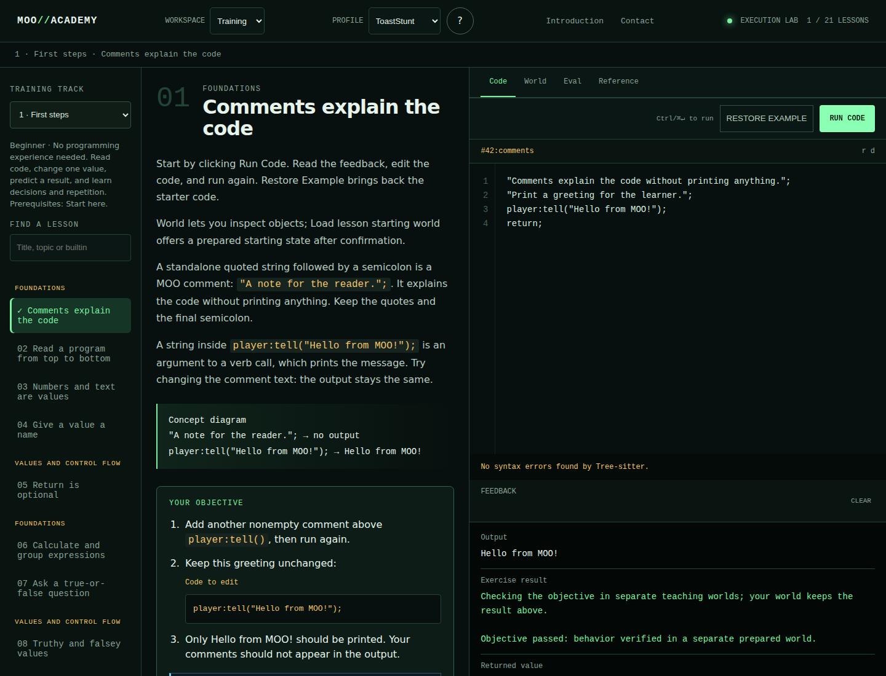

# MOO Academy

Learn MOO programming by reading a lesson, running its code, inspecting the world,
and trying a change. MOO Academy is a browser-based learning workspace for people
starting with no programming experience and progressing into intermediate MOO.
MOO is the language used to build programmable, shared text worlds: objects hold
properties (data) and verbs (behavior).



*The learning workspace: lessons, editable code, and results together in one view.*

## What you can do

- Follow guided tracks through values, collections, objects, inheritance, verbs,
  debugging, tasks, and server integrations. Lessons remain accessible in any order.
- Run and edit real MOO examples with syntax diagnostics and execution feedback.
  Exercises check objectives; exploration lessons invite experiments.
- Switch between **ToastStunt** (the default) and **LambdaMOO** educational profiles.
- Inspect objects, properties, verbs, inheritance, and containment in **World**;
  try expressions and statements in **Eval**.
- Experiment in separate saved sandbox worlds and browse the builtin reference.
- Explore eleven **Common Packages** utility tracks and imported ToastCore source,
  with labeled browser examples and real-server walkthroughs.

Code executes locally in a worker using the bundled
[@sindomecorp/moo-in-javascript](https://www.npmjs.com/package/@sindomecorp/moo-in-javascript) runtime.
No MOO server, database service, account, or API key is required. This is an
educational environment: it does not reproduce a complete multiplayer server.
Networking and host integrations use documented local simulations or fixtures;
permissions and scheduling have limits. See the in-app Reference and
[real-server field notes](dist/field-notes.html).

## Quick start

Use **Node.js 24** (also recorded in `.nvmrc`), npm, and **Python 3** available as
`python3`. Git is needed to clone the repository. Commands below run from its root.

```sh
git clone https://github.com/SindomeCorp/moo-academy.git
cd moo-academy
npm ci
npm start
```

Open **http://127.0.0.1:8000**. Stop the server with `Ctrl+C`.
If you use nvm, run `nvm install` and `nvm use` before installing dependencies.

The complete site and its runtime/parser assets are checked in, so **no build is
needed to try the app**. Python alone can serve those assets with
`python3 scripts/serve.py`. Serve over HTTP; opening `index.html` directly with
`file://` will not work.

For another port or access from another device on your network:

```sh
npm start -- --port 8080 --bind 0.0.0.0
```

The included Python server is for local development. For a public site, follow
[Hosting](docs/hosting.md).

## Build and develop

**`dist/` contains authored application source. Do not delete it as build cleanup.**
Edit its HTML, CSS, and JavaScript directly, then refresh the browser. There is no
application bundler or compilation step. The build commands refresh bundled
parser and runtime dependencies without rebuilding the authored site.

Before rebuilding or running the full test suite, install the pinned grammar
checkout (the tests also use its upstream fixtures):

```sh
git clone https://github.com/SindomeCorp/tree-sitter-moo.git vendor/tree-sitter-moo
git -C vendor/tree-sitter-moo checkout --detach 5e42672ffa1a4e955fe6a04da534396282522242
npm run build
```

| Command | Purpose |
| --- | --- |
| `npm run build:parser` | Copy the pinned upstream WASM, parser loader, licenses, and provenance. |
| `npm run build:runtime` | Copy the installed runtime and create its content-addressed release. |
| `npm run build` | Run both dependency builds above. |
| `npm run build:common-packages` | Re-import pinned ToastCore data; an advanced maintenance operation. |

The runtime dependency is pinned to `@sindomecorp/moo-in-javascript@0.2.5` from
the npm registry. `npm ci` verifies the lockfile integrity; no local tarball is
needed. Builds copy the installed package, retain licenses, and record registry
provenance and a deterministic shipped-file manifest. Rebuilding after installation
requires no additional runtime download.
Common Packages snapshots are already included. Their regeneration and optional
native-server comparisons are documented in [Common Packages](docs/common-packages.md).

## Test locally

Complete the dependency and grammar setup above, then install Playwright browsers:

```sh
npx playwright install chromium firefox webkit
# On Linux, if system libraries are missing (may require sudo):
npx playwright install-deps chromium firefox webkit
npm run test:check
```

`test:check` verifies assets, runs Node tests and the configured browser matrix,
and enforces coverage gates. CI/CD is not configured; validation is run locally.

| Command | Checks |
| --- | --- |
| `npm test` | Node tests for examples, grammar, checkpoints, grading, storage coordination, and utilities. |
| `npm run test:seo` | Public-page metadata, canonical URLs, sharing assets, and indexing files. |
| `npm run test:assets` | Bundled files, hashes, dependency pins, and licenses. |
| `npm run test:browser` | Full Chromium suite plus selected Firefox and WebKit scenarios. |
| `npm run test:coverage` | Node and Chromium tests with coverage gates. |
| `npm run test:check` | Assets, Node tests, the complete configured browser matrix, and coverage gates. |

See [Testing](docs/testing.md) for focused runs, browser overrides, troubleshooting,
coverage details, and reproducing the README screenshot.

## Host the app

The production address is **https://moo.mudverse.com/**. Page canonicals and the
sitemap use that origin. See the [SEO launch guide](docs/seo.md) for indexing and
Search Console setup after deployment.

Publish the **contents of `dist/`**, preserving their relative paths, to a static
HTTP(S) host. No Node or Python process is needed in production. Use correct
JavaScript and WASM content types, serve compressed assets when available, and
preserve the distinction between fresh application files and immutable runtime
releases. The [hosting guide](docs/hosting.md) covers manual deployment, cache
headers, updates, rollback, and smoke checks.

## Saved work and recovery

Worlds and drafts are stored in the current browser. Each track and named sandbox
has its own world for each profile; lesson progress is shared between profiles.
Code drafts save as you edit, while Eval text saves when you evaluate it.
Your work does not automatically sync to another browser, device, or site origin.

- **Restore example** restores lesson code while keeping the world and progress.
- **Load lesson starting world** replaces the active track's world with its
  prepared checkpoint after confirmation; drafts and progress remain.
- **Reset track/sandbox world** resets only that workspace's world.
- **Export world** downloads objects and properties. **Download drafts** separately
  downloads code and unrun Eval text as JSON for copying back into the editors.

Export before replacing a world or clearing browser storage. Check the save-status
message: unavailable storage can put the app into session-only mode, and another
tab can own write access. See the in-app Introduction for a learner walkthrough
and [Technical overview](docs/architecture.md) for persistence and recovery details.

## Repository guide

| Location | Contents |
| --- | --- |
| `dist/` | Authored static app, curriculum, runtime releases, and bundled learning data. |
| `scripts/` | Dependency builds, local server, validation, imports, and screenshot capture. |
| `tests/` | Node tests and Playwright browser scenarios. |
| `docs/` | Hosting, testing, architecture, and curriculum maintenance guides. |

To contribute, read [CONTRIBUTING.md](CONTRIBUTING.md) and, for curriculum changes,
[Lesson authoring](docs/lesson-authoring.md). Report bugs or propose lessons through
[GitHub issues](https://github.com/SindomeCorp/moo-academy/issues), including the
track, lesson, profile, browser, and expected versus actual behavior. General
questions can also go to [Brendan](mailto:brendan@withmorehope.org).

## License and acknowledgments

Original MOO Academy code and learning content are licensed under the
[MIT License](LICENSE), copyright 2026 SindomeCorp. Bundled software and imported
ToastCore material retain their own licenses and author attributions; the project
license does not replace them. See [Third-party notices](THIRD_PARTY_NOTICES.md).

This product includes software developed or owned by Caldera International, Inc.
